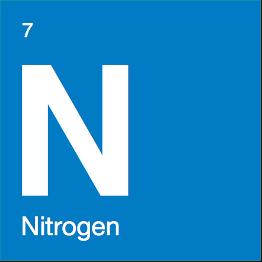

<table width=100%>
    <tr>
        <td>
            
        </td>
        <td>
            <h1 class="text-center">Nitrogen connects devices together into applications.</h1>
        </td>
    </tr>
</table>

    Nitrogen is a cloud framework for the Internet of Things (IoT). The backend is all written in Node.js. Device side, there is an agent written in Node.js but you can use Rest or MQTT and skip the agent completely. 

There are three possible places to get started depending on what you want to do first. 

    

        <h3><a href="./guides/device/index.html">Device side development</a></h3>
        

            Connect devices over a variety of protocols including REST and MQTT to Nitrogen or run the Node.js agent. 
        

        

            <ul>
                <li>Virtual Devices</li>
                <li>Raspberry PI</li>
                <li>Arduino Yun</li>
            </ul>
        

    

    

        <h3><a href="./guides/serverside/index.html">Server side development</a></h3>
        

            Build applications with a common cloud and device application model centered on JavaScript.
            <uL>
                <li>Device Registry</li>
                <li>Ingestion</li>
                <li>Message Routing</li>
                <li>Consumption</li>
            </uL>
        

    

    

        <h3><a href="./guides/devops">Dev Ops</a></h3>
        If you want to get the Nitrogen server up and running, you'll need to look at the dev ops section. 
        

            <ul>
                <li>Local VM for development with Vagrant</li>
                <li>Running the services by hand</li>
                <li>Deployment in production using Docker</li>
            </ul>
        

    

Nitrogen is up in Github at [NitrogenJS](http://github.com/nitrogenjs) and housed in a number of repositories. 

Server side main projects
<ol>
<li><a href="http://github.com/nitrogenjs/frontdoor">frontdoor</a>: Service front end for Nitrogen</li>
<li><a href="http://github.com/nitrogenjs/ingest">ingest</a>: Ingest services for Nitrogen</li>
<li><a href="http://github.com/nitrogenjs/registry">registry</a>: Registry services for Nitrogen</li>
<li><a href="http://github.com/nitrogenjs/consumption">consumption</a>: Egress services for Nitrogen</li>
<li><a href="https://github.com/nitrogenjs/admin">admin</a>: Web admin tool for working with the Nitrogen service.</li>
</ol>
Client side main projects

<ol>
<li><a href="https://github.com/nitrogenjs/client">client</a>: JavaScript client library for building Nitrogen devices and applications.</li>
<li><a href="https://github.com/nitrogenjs/cli">cli</a>: Command line interface for working with the Nitrogen service.</li>
</ol>

Helpers
<ol>
<li><a href="https://github.com/nitrogenjs/service">service</a>: Core platform responsible for managing principals, security, and messaging.</li>
<li><a href="https://github.com/nitrogenjs/devices">devices</a>: Device principals for common pieces of hardware.</li>
<li><a href="https://github.com/nitrogenjs/commands">commands</a>: CommandManagers and schemas for well known command types.</li>
<li><a href="https://github.com/nitrogenjs/reactor">reactor</a>: Always-on hosted application execution platform.</li>
<li><a href="https://github.com/nitrogenjs/apps">apps</a>: Project maintained Nitrogen applications.</li>
</ol>

<a href="/docs/concepts/overview.html" class="btn green"  style="margin-top: 10px">Learn More</a>
